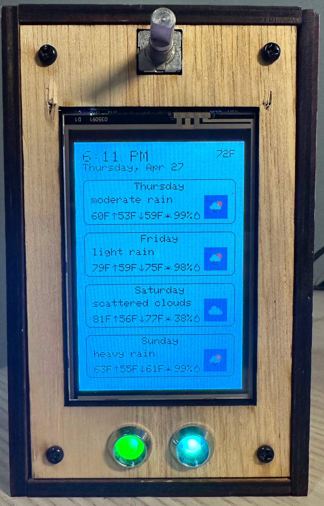
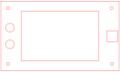
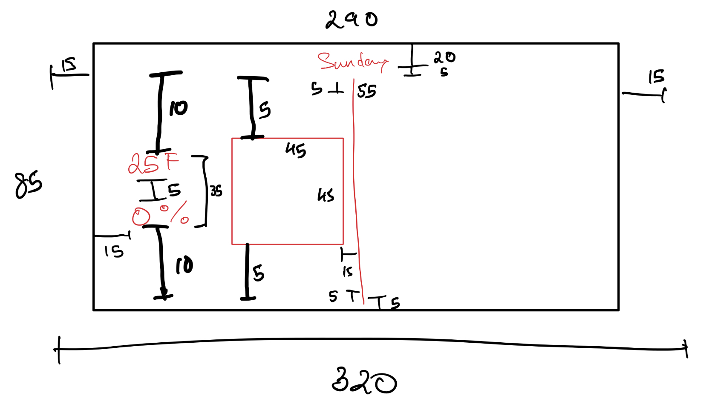
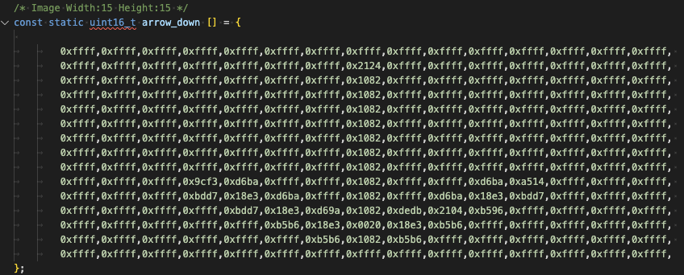

# Weather Display
Aditya Vidyadharan

## Description
This weather display is a simple weather app that displays the forecast for the next 3 days. It uses the [OpenWeatherMap API](https://openweathermap.org/api) to fetch the weather data using the student [plan](https://openweathermap.org/price#:~:text=Developer%20plan%20for%20current%20weather%20and%20forecasts).

<p align="center">
    
</p>

## Table of Contents
- [Weather Display](#weather-display)
  - [Description](#description)
  - [Table of Contents](#table-of-contents)
  - [Hardware](#hardware)
    - [Electronics](#electronics)
    - [Enclosure](#enclosure)
  - [Software](#software)
    - [Libraries](#libraries)
  - [Scripts](#scripts)
  - [Usage](#usage)
- [Development Process](#development-process)
  - [Iterative Design](#iterative-design)
    - [UI Design](#ui-design)
    - [Logo Conversion](#logo-conversion)
    - [JSON Parsing](#json-parsing)
  - [Skills Learned](#skills-learned)
    - [Hardware](#hardware-1)
    - [Software](#software-1)


## Hardware

### Electronics

The display is built using the following hardware:
- [ESP32](https://learn.adafruit.com/adafruit-huzzah32-esp32-feather)
- [Adafruit 3.5" 320x480 Display](https://www.adafruit.com/product/2050)
- [DHT11 Temperature and Humidity Sensor](https://www.adafruit.com/product/386)
- [Rotary Encoder](https://www.amazon.com/Cylewet-Encoder-15%C3%9716-5-Arduino-CYT1062/dp/B06XQTHDRR)
- [5mm LED Holder](https://www.adafruit.com/product/2178)
- RGB LEDs

### Enclosure
The enclosure is built using a laser cut plywood box. The SVG file can be found [here](https://www.festi.info/boxes.py/ElectronicsBox?FingerJoint_angle=90.0&FingerJoint_style=rectangular&FingerJoint_surroundingspaces=2.0&FingerJoint_bottom_lip=0.0&FingerJoint_edge_width=1.0&FingerJoint_extra_length=0.0&FingerJoint_finger=2.0&FingerJoint_play=0.0&FingerJoint_space=2.0&FingerJoint_width=1.0&x=132&y=79&h=50&outside=0&triangle=25.0&d1=3&d2=3.05&d3=3.0&outsidemounts=0&holedist=6.35&thickness=5&format=svg&tabs=0.0&qr_code=0&debug=0&labels=0&labels=1&reference=100&inner_corners=loop&burn=0.1&language=en&render=1). It was generated with [Festi.info](https://www.festi.info/boxes.py/).

The faceplate for the box was also laser cut from plywood but does not use the Festi.info generator. The SVG file can be seen here:

<p align="center">
    
</p>
The faceplate contains cutouts for the display, the rotary encoder, and the LED holders.

## Software

### Libraries
The following libraries are used in the project:
- [Adafruit GFX](https://learn.adafruit.com/adafruit-gfx-graphics-library/overview) (Used for most Adafruit displays)
- [Adafruit HX8357](https://github.com/adafruit/Adafruit_HX8357_Library) (Code specific to this display necessary for the GFX library to work)
- [ArduinoJson](https://arduinojson.org/) (Used to parse the JSON data from the API)
- [AiEsp32RotaryEncoder](https://github.com/igorantolic/ai-esp32-rotary-encoder) (ESP32 specific library used to read the rotary encoder)
- [TimeLib](https://github.com/PaulStoffregen/Time) (Used to convert the UNIX timestamp from the API to a human readable time and keep track of time)
- [ESP32 Core Library](https://docs.espressif.com/projects/arduino-esp32/en/latest/libraries.html#:~:text=S3%20(Datasheet)-,APIs,-%C2%B6) (ESP32 specific libraries used for controlling WiFi, PWM, etc.)

## Scripts
In order to use the icons on the display, they need to be converted to C++ headers with an array of the pixel data as hex values.

The following scripts are used to generate the weather icons:
- [fetch_icons.py](scripts/fetch_icons.py) (Fetches the weather icons from the OpenWeatherMap API)
- [resize_icons.py](scripts/resize_icons.py) (Resizes the icons to 32x32 pixels)
- [svg_to_headers.sh](scripts/svg_to_headers.sh) (Converts SVG files to C++ headers)
- [convert.py](scripts/convert.py) (Converts the icons to C++ headers)

The result is the icons folder which contains the C++ headers for each icon.

To generate the headers, run the following commands in the scripts folder:

```bash
python3 fetch_icons.py
python3 resize_icons.py
./svg_to_headers.sh
```

## Usage
The display can be used to display the current weather conditions and the forecast for the next 3 days. The rotary encoder can be used to increase/decrease the brightness of the display.

The left RGB shows the state of the WiFi connection.
-  Blue: Initial Startup
-  Red (Flashing): Error connecting to WiFi
-  Green: Connected to WiFi

The right RGB shows the status of the API call.
-  Blue: Initial Startup
-  Amber: Fetching data from API
-  Green: Data successfully fetched from API
-  Red: Error fetching data from API
-  Cyan: Rain in forecast for today

After the initial weather API call and time sync on startup, the forecast will update every three hours. The indoor temperature in the top right refershes every minute.

The display uses a cream colored background  (#F0EAD6)

# Development Process
## Iterative Design

From the start, most of the design was set. I knew that I needed an ESP32 for its WiFi functionality and I picked a display that was a reasonable size, not too expensive, and readily available. The DHT11, Rotary Encoders, and RGB LEDs were all picked based on what I had on hand. I just needed to order a few holders along with the display from Adafruit.

When it came time to connect these components and write code, I worked by slowly adding parts. First I tried a few screen layouts with hardcoded data, then worked on parsing data from the API, and then putting it together. Then I slowly added more elements: time keeping, indoor temperature, brightness control, and status LEDs.

The hardest part of the design was the enclosure for me. Specifically, the faceplate. Making the rest of the box was fairly easy since I've used laser cutters before and the Festi website made generating the SVG file very easy. The faceplate was a bit more difficult since I had to make sure that the cutouts were the right size and in the right place. I made my initial layout with the measurements available online for the parts and then worked by using actual measurements of the parts and several cuts to see what worked. After several rounds of correcting measurements and moving things around, I was able to make the final faceplate design.

I had initially thought about 3D printing the faceplate but after talking to one of the Instructors at the Invention Studio, he recommended that I just laser cut it. This turned out to be a good idea since I was able to make the faceplate in a few minutes and make changes quickly rather than having to wait several hours for a print.

### UI Design

The Adafruit Graphics library uses a pixel coordinate system that requires everything to have an `x`, `y`, `width`, and `height` measured in pixels. This makes laying out elements on the screen a tedious process that needs manual measurements for everything to be centered/aligned.

Here is the initial layout I made for the screen:

<p align="center">
    
</p>

### Logo Conversion

In order to make the weather display more readable, I used the logos provided by the API to show the current weather conditions. The API provides the logos as SVG files so I needed to convert them to a format that the Adafruit GFX library could use. I used the [svg_to_headers.sh](scripts/svg_to_headers.sh) script to convert the SVG files to C++ headers with an array of the pixel data as hex values as outlined in [the scripts section](#scripts).

Here is an example of the arrow down icon:

<p align="center">
    
</p>

>A faint outline for the arrow can be seen in the hex values. The header file for the icon can be found [here](icons/headers/arrow_down.h).

### JSON Parsing

The API returns a JSON object with the current weather conditions and the forecast for the next 5 days. I used the [ArduinoJson](https://arduinojson.org/) library to parse the JSON object and extract the data I needed.

Here is an example of a response from the API:

```json
{
    "city": {
        "id": 4180439,
        "name": "Atlanta",
        "coord": {
            "lon": -84.3954,
            "lat": 33.7751
        },
        "country": "US",
        "population": 420003,
        "timezone": -14400
    },
    "cod": "200",
    "message": 13.3365954,
    "cnt": 9,
    "list": [
        {
            "dt": 1682614800,
            "sunrise": 1682592784,
            "sunset": 1682641028,
            "temp": {
                "day": 59.07,
                "min": 53.11,
                "max": 60.24,
                "night": 60.04,
                "eve": 59.9,
                "morn": 53.91
            },
            "feels_like": {
                "day": 59.23,
                "night": 60.4,
                "eve": 59.86,
                "morn": 53.51
            },
            "pressure": 1015,
            "humidity": 97,
            "weather": [
                {
                    "id": 501,
                    "main": "Rain",
                    "description": "moderate rain",
                    "icon": "10d"
                }
            ],
            "speed": 8.55,
            "deg": 99,
            "gust": 21.99,
            "clouds": 100,
            "pop": 1,
            "rain": 6.11
        },
        {
            "dt": 1682701200,
            "sunrise": 1682679121,
            "sunset": 1682727475,
            "temp": {
                "day": 75.56,
                "min": 59.81,
                "max": 79.9,
                "night": 65.44,
                "eve": 76.68,
                "morn": 60.03
            },
            "feels_like": {
                "day": 75.45,
                "night": 65.07,
                "eve": 76.01,
                "morn": 60.33
            },
            "pressure": 1008,
            "humidity": 56,
            "weather": [
                {
                    "id": 500,
                    "main": "Rain",
                    "description": "light rain",
                    "icon": "10d"
                }
            ],
            "speed": 11.12,
            "deg": 246,
            "gust": 18.7,
            "clouds": 64,
            "pop": 0.98,
            "rain": 3.04
        }
    ]
}
```

## Skills Learned

### Hardware
The previous laser cutter work I had done was wood/metal engravings. Cutting required a different skillset since I needed to make precise holes for everything to fit through rather than just a graphical design for an engraving.


### Software
This project was my first time using the ESP32 so I learned about how to take an Arduino-like platform and give it WiFi functionality. I also learned about some of the ESP32 specifics like it's PWM control system. 

In addition, there were several libraries that I learned to use for functionality like JSON parsing, time keeping, and rotary encoders that I had not used before.